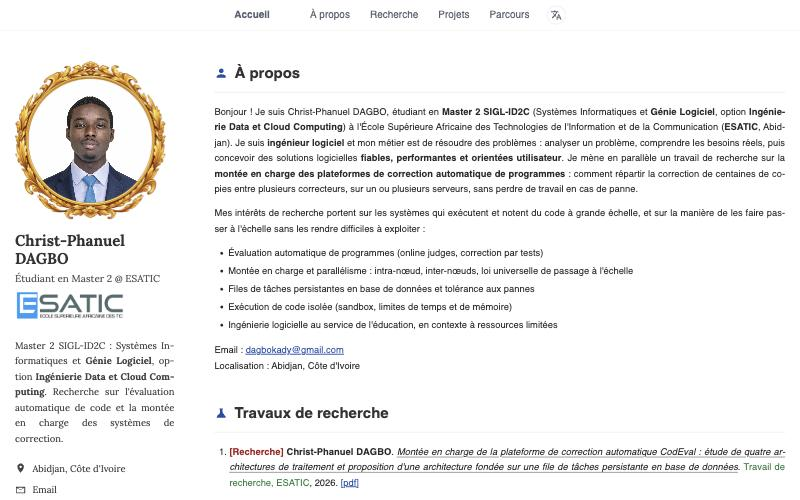

# Portfolio · Christ-Phanuel DAGBO

Portfolio académique et professionnel de **Christ-Phanuel DAGBO**, étudiant en Master 2 SIGL-ID2C
(Systèmes Informatiques et Génie Logiciel, option Ingénierie Data et Cloud Computing) à l'ESATIC,
Abidjan.

Le site présente mon profil, mes travaux de recherche, mes projets et mon parcours, sur le modèle
des pages personnelles de chercheurs.



## Sections

- **À propos** : présentation, intérêts de recherche, contact
- **Travaux de recherche** : publications et travaux en cours, avec lien vers le PDF
- **Projets** : projets réalisés, lien vers le site et technologies utilisées
- **Parcours** : expériences (avec le logo de la structure), formation, compétences,
  certifications et langues

La colonne de gauche (photo, titre, école, liens) reste visible pendant la lecture et défile au
même rythme que la page.

## Fonctionnalités

- **Responsive** : mise en page en deux colonnes sur ordinateur, une seule colonne sur tablette et
  téléphone, testée de 320 px à 1280 px de large
- **Traduction** : bouton de traduction dans la barre de navigation (français, anglais, japonais,
  chinois, russe, espagnol, allemand), via Google Traduction
- **Contenu séparé du code** : tout le texte du site est dans un seul fichier de données

## Technologies

- [React 19](https://react.dev) et [Vite](https://vite.dev)
- CSS sans framework (Grid et Flexbox), dans `style.css`
- Police [Lora](https://fonts.google.com/specimen/Lora) (Google Fonts) pour la colonne de gauche
- Icônes en SVG intégrées directement dans le code, sans bibliothèque externe

## Lancer le projet

Prérequis : Node.js 20.19+ ou 22.12+ (exigé par Vite 8).

```bash
git clone https://github.com/dagbokady/00-Web-Curriculum-Vitae.git
cd 00-Web-Curriculum-Vitae
npm install
npm run dev
```

Le site est alors disponible sur http://localhost:5173.

| Commande          | Rôle                                           |
| ----------------- | ---------------------------------------------- |
| `npm run dev`     | Serveur de développement avec rechargement     |
| `npm run build`   | Version de production dans `dist/`             |
| `npm run preview` | Sert la version de production en local         |
| `npm run lint`    | Vérifie le code avec ESLint                    |

## Structure

```
00-Web-Curriculum-Vitae/
├── index.html              # Page d'entrée (titre, favicon, police)
├── style.css               # Tous les styles du site
├── src/
│   ├── main.jsx            # Montage de l'application React
│   ├── App.jsx             # Composants : navigation, colonne de gauche, sections
│   └── data/portfolio.jsx  # Contenu du site
├── public/
│   ├── favicon.png         # Favicon (photo circulaire)
│   └── files/              # Photo, cadre, PDF de recherche, logos
└── docs/apercu.jpg         # Capture utilisée dans ce README
```

## Modifier le contenu

Tout se passe dans [`src/data/portfolio.jsx`](src/data/portfolio.jsx) :

| Export           | Contenu                                                   |
| ---------------- | --------------------------------------------------------- |
| `identity`       | Nom, photo, titre, logo de l'école, bio, liens            |
| `about`          | Texte de présentation et intérêts de recherche            |
| `research`       | Travaux de recherche (titre, lieu, année, liens)          |
| `projects`       | Projets (étiquette, titre, lien, technologies, texte)     |
| `experience`     | Expériences (date, poste, structure, logo, description)   |
| `education`      | Formation                                                 |
| `skills`         | Compétences par catégorie                                 |
| `certifications` | Certifications avec lien de vérification                  |
| `languages`      | Langues parlées                                           |

Les images (photo, logos) et le PDF se placent dans `public/files/` et s'appellent avec un chemin
commençant par `/files/...`. Si le logo d'une expérience est introuvable, le nom de la structure
s'affiche à la place.

## Contact

- Email : [dagbokady@gmail.com](mailto:dagbokady@gmail.com)
- GitHub : [dagbokady](https://github.com/dagbokady)
- LinkedIn : [christ-phanuel-dagbo](https://linkedin.com/in/christ-phanuel-dagbo)
